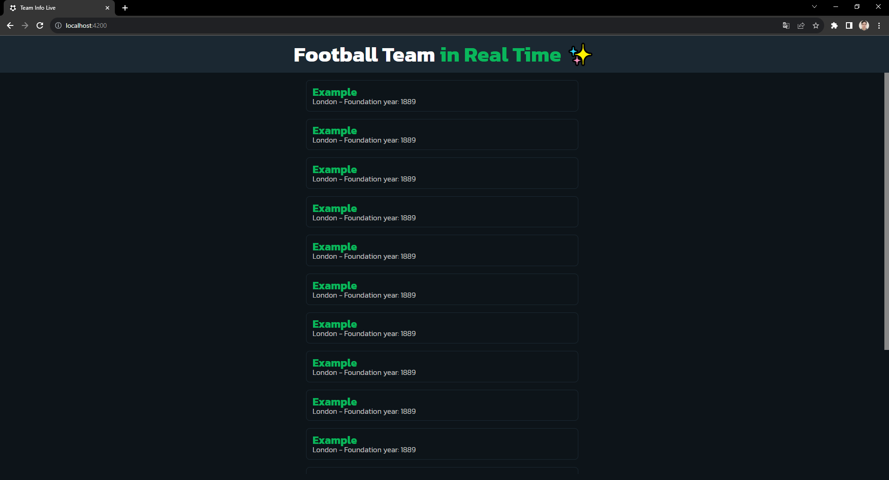
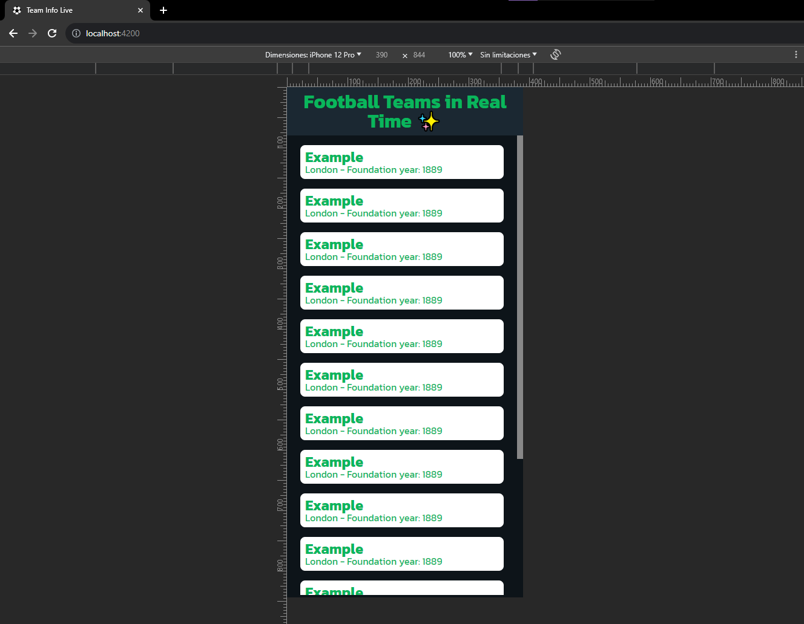

# Team Info Live 🟢🚀

## Descripción

Team Info Live es una aplicación de frontend desarrollada en Angular que proporciona información en tiempo real sobre equipos de fútbol utilizando WebSockets.

## Objetivo del Proyecto

El objetivo principal de este proyecto es aprender y poner en práctica el uso de WebSockets para lograr una comunicación continua y en tiempo real con el servidor.

## Captura de Pantalla

### Versión de Escritorio

### Versión Móvil

## Requisitos

Asegúrate de tener instalado lo siguiente antes de comenzar:

- [Node.js](https://nodejs.org/)
- [Angular CLI](https://cli.angular.io/)

## Instalación

1. Clona este repositorio: `git clone https://github.com/CesarCent17/team-info-live`
2. Navega al directorio del proyecto: `cd team-info-live`
3. Instala las dependencias: `npm install`

## Uso

1. Inicia la aplicación en modo de desarrollo: `ng serve`
2. Abre tu navegador y visita `http://localhost:4200`
